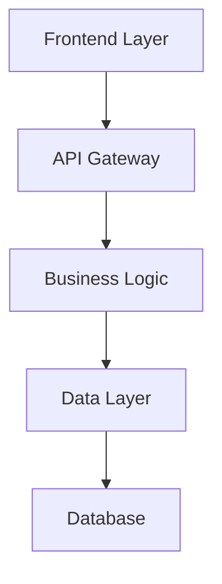

# Technical Design

Create comprehensive technical design for feature: **$ARGUMENTS**

## Approval Gate: Requirements Check

**CRITICAL**: Design can only be generated after requirements are approved.

### Approval Status Check
- Spec metadata: @.kiro/specs/$ARGUMENTS/spec.json

**STOP HERE** if spec.json shows:
```json
"approvals": {
  "requirements": {
    "approved": false
  }
}
```

**Required Actions for Requirements Approval**:
1. **Review requirements.md** - Read through the generated requirements thoroughly
2. **Edit if needed** - Make any necessary changes directly in the requirements.md file
3. **Manual approval required** - Update spec.json manually to set `"requirements": {"approved": true}`
4. **Reasoning**: Human review ensures requirements accuracy before design phase

**Example approval in spec.json**:
```json
{
  "approvals": {
    "requirements": {
      "generated": true,
      "approved": true  // ← Set this to true after human review
    }
  },
  "phase": "requirements-approved"
}
```

**Only proceed to design generation after requirements are explicitly approved by human review.**

## Context Analysis

### Steering Context
- Current architecture: @.kiro/steering/structure.md
- Technology stack: @.kiro/steering/tech.md
- Product constraints: @.kiro/steering/product.md

### Requirements Context (APPROVED)
- Feature requirements: @.kiro/specs/$ARGUMENTS/requirements.md
- Current design: @.kiro/specs/$ARGUMENTS/design.md
- Spec metadata: @.kiro/specs/$ARGUMENTS/spec.json

## Task: Create Technical Design

**Prerequisites Verified**: Requirements are approved and ready for design phase.

Generate comprehensive design document in the language specified in spec.json:

### 1. Design Document Structure
Create design.md in the language specified in spec.json (check `@.kiro/specs/$ARGUMENTS/spec.json` for "language" field):

```markdown
# Technical Design

## Overview
[Technical overview of the implementation approach]

## Architecture
[Architecture diagram using mermaid]



## Technology Stack
- **Frontend**: [React/Vue/Next.js] + [TypeScript]
- **Backend**: [FastAPI/Express/Django] + [Language]
- **Database**: [PostgreSQL/MySQL/MongoDB]
- **Authentication**: [JWT/OAuth/Auth0]
- **Testing**: [Jest/pytest] + [Testing Library/Playwright]
- **Deployment**: [Docker/Vercel/AWS]

## Components and Interfaces
[Detailed component design with clear interfaces]

### API Endpoints
```
GET /api/[resource]
POST /api/[resource]
PUT /api/[resource]/:id
DELETE /api/[resource]/:id
```

### Data Flow
[Description of how data flows through the system]

## Data Models
[Data structures and database schemas]

```typescript
interface [ModelName] {
  id: string;
  // Add relevant fields
}
```

## Error Handling
[Comprehensive error handling strategy]

## Security Considerations
[Authentication, authorization, data validation]

## Performance & Scalability
[Caching, optimization, scaling strategy]

## Testing Strategy
[Unit, integration, and E2E testing approach]
```

### 2. Design Quality Guidelines
- **Architecture Alignment**: Follow existing architectural patterns
- **Technology Consistency**: Use established technology stack
- **Interface Design**: Define clear component interfaces
- **Data Modeling**: Design appropriate data structures
- **Error Handling**: Plan comprehensive error scenarios
- **Testing Strategy**: Include unit, integration, and E2E testing

### 3. Integration Considerations
Based on steering and requirements:
- How components integrate with existing architecture
- Database schema changes required
- API endpoint design
- Performance considerations
- Security requirements

### 4. Mermaid Diagrams
Include relevant diagrams:
- System architecture
- Component interactions
- Data flow diagrams
- Sequence diagrams for key workflows

### 5. Update Metadata
Update spec.json with:
```json
{
  "phase": "design-generated",
  "progress": {
    "requirements": 100,
    "design": 100,
    "tasks": 0
  },
  "approvals": {
    "requirements": {
      "generated": true,
      "approved": true
    },
    "design": {
      "generated": true,
      "approved": false
    }
  },
  "updated_at": "current_timestamp"
}
```

### 6. Document Generation Only
Generate the design document content ONLY. Do not include any review or approval instructions in the actual document file.

---

## REVIEW AND APPROVAL PROCESS (Not included in document)

The following is for Claude Code conversation only - NOT for the generated document:

### Human Review Required
After generating design.md, inform the user:

**NEXT STEP**: Human review required before proceeding to tasks phase.

### Review Checklist:
- [ ] Technical design is comprehensive and clear
- [ ] Architecture aligns with existing system
- [ ] Technology choices are appropriate
- [ ] Components and interfaces are well-defined
- [ ] Security and performance considerations are addressed

### To Approve:
After reviewing, update `.kiro/specs/$ARGUMENTS/spec.json`:
```json
{
  "approvals": {
    "requirements": {
      "generated": true,
      "approved": true
    },
    "design": {
      "generated": true,
      "approved": true
    }
  },
  "phase": "design-approved"
}
```

**Only after approval can you proceed to `/spec-tasks $ARGUMENTS`**

## Instructions

1. **Check spec.json for language** - Use the language specified in the metadata
2. **Analyze requirements thoroughly** to understand scope
3. **Follow existing architecture patterns** from steering
4. **Create detailed component design** with clear interfaces
5. **Include comprehensive diagrams** using mermaid
6. **Plan error handling and testing** strategies
7. **Update tracking metadata** upon completion

Generate design that provides clear blueprint for implementation phase.
ultrathink